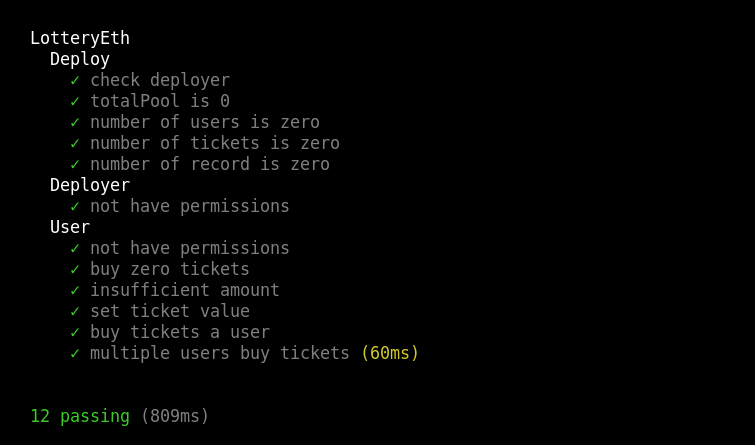

## LotteryEth

#### Resumen

LotteryEth es una lotería en la blockchain. Donde podes participar comprando boletos, el azar dirá si eres el ganador y obtienes las recompensas que es el pozo acumulado.

#### Casos de uso

- **Usuarios**

  - Comprar boletos
  - Retirar recompensas

- **Owner**
  - Disparar el evento que busca al usuario ganador
  - Cambiar el precio del boleto
  - Pausar/Des pausar el contrato

#### Aclaraciones del contrato

  * Por lotería hay un solo ganador !Se lleva todo lo que está en el pozo acumulado!
  * No hay reembolsos en la compra de boletos
  * Al comprar boletos debe pagar justo ya que una vez que pase las validaciones se agrega al pozo acumulado.
    Ejemplo: El boleto sale 1 ETHER. Quiero comprar 3 boletos. Por lo tanto el monto a enviar es 3 ETHER.
    Si envió menos de esa cantidad no te va a dejar comprar.
    Si envió más de esa cantidad solo va a comprar 3 boletos y lo restante lo agrega al pozo acumulado.
  * Al terminar una lotería se reinician todos los datos menos el historial de loterías.
  * Si el contrato esta pausado no se va a poder retirar y tampoco comprar boletos
  * El owner no obtiene ningún tipo de ganancia

#### Aclaraciones a nivel técnico
  * Lo que es el kernel del contrato(obtener un ganador de la loteria) no logre testearlo ya que no pude hacer un mock de chainlink.
    Lo que si hice es probarlo directamente en la red.

#### Template

Template utilizado como base https://github.com/abarmat/solidity-starter

#### Dapp

Repositorio: https://github.com/dpinones/Lottery-Frontend

La Dapp esta alojada en heroku. Link: https://dapp-lottery-eth.herokuapp.com/

Video de la demo(Velocidad x2): https://www.loom.com/share/6f273d8d3e294dc79d3afb143e579560

Más allá de no ser experto en frontend y ether.js trate de crear una Dapp simple donde se puede interactuar con el contrato. Claramente es secundario lo que en realidad tiene importancia es el desarrollo del contrato.

#### Contrato deploy

- **LotteryEth**
  - Newtwork: Kovan
  - Contract address : 0x824eD0C80CF2913F15f41FEC3148E162E65C52e3

#### Testing

